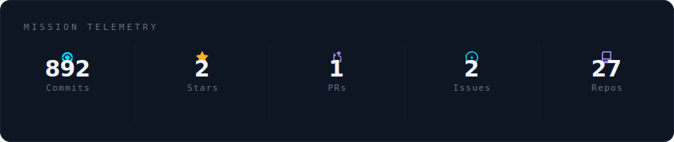

<!-- ═══════════ GALAXY HEADER ═══════════ -->

 

<!-- ═══════════ SOCIAL BADGES ═══════════ -->

  

---

<!-- ═══════════ MISSION TELEMETRY ═══════════ -->

  

 

<!-- ═══════════ TECH STACK ═══════════ -->

  

 

<!-- ═══════════ FEATURED PROJECTS ═══════════ -->

  

 

---

<!-- ═══════════ ABOUT ═══════════ -->

### 🎯 Sobre Mim

<samp>
Desenvolvedor <strong>full stack com foco em backend</strong>, atuando como <strong>freelancer na Workana</strong> 
desenvolvendo <strong>sistemas e APIs</strong> para diferentes empresas e negócios.  
Experiência com <strong>Python · C#/.NET · Node.js · Django · Flask · ASP.NET Core</strong> 
Atuo com <strong>bancos de dados relacionais e NoSQL</strong>, <strong>Docker</strong> e fundamentos de <strong>redes e segurança</strong>.  
Valorizo <strong>Clean Code · SOLID · REST · Security-first</strong>
</samp>

---

<!-- ═══════════ FOOTER ═══════════ -->

  Generated by
  <a href="https://github.com/Brayandev0/galaxy-profile">galaxy-profile</a>
  · auto-updated every 12 hours 🚀

